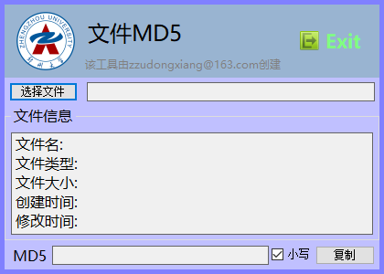
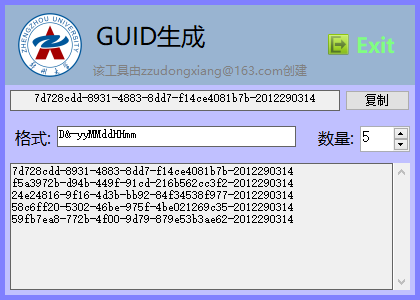
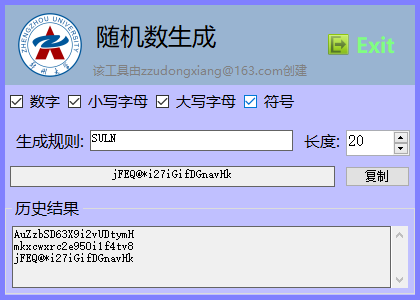
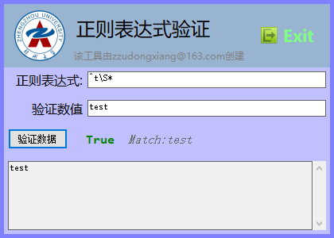
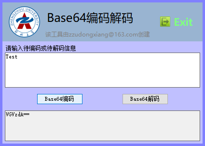

# 桌面开发小助手

使用局域网Socket连接控制显示端显示一个倒计时, 并可以在控制端修改相关的内容设置

`开发平台`: VS2019

`开发技术`: C#, WinForm

`使用到的技术`: WinForm无边框, 透明背景, 动态UI等

## 基本介绍

使用Winform编写一个常驻桌面的小组件, 该组件具有一些简便的小功能, 这些功能可以帮助开发者

目前已具有的功能有: 

> `FileMD5`: 文件的MD5码计算功能
>
> `GUID`,: 生成GUID, 或者批量生成GUID
>
> `Random`: 按照指定格式生成随机数
>
> `Regex`: 验证正则表达式
>
> `Base64`: Base64编码与解码计算

## FileMD5

选择要生成MD5的文件, 会自动计算出文件的相关信息, 并可实现MD5的一键复制

## GUID

如图所示生成的GUID会带有日期信息, 由格式`D&-yyMMddHHmm`控制

其中

`D`: 指随机生成的GUID序列号

`&`: 为连接符, 用于生成的GUID与后面的内容连接

`-`: 字符串, 会原封不动的出现在指定位置

`yyMMddHHmm`: 时间格式, 参见C#的DateTime.ToString格式

## Random

可选择随机数生成的长度与规则

生成规则栏中`SULN`字母对应上面勾选的生成范围

通过重复对应的大写字母可以提高对应范围的字符出现的概率

如`LNNNNNNN`要比`LN`生成的随机数中数字的内容概率大

> 计算概率时, 每个集合对应的权重默认不相同
>
> 数字权重为10
>
> 小写字母/大写字母权重为26
>
> 符号权重为9 (主要包含以下符号: `!@#$%^&*.`)

## Regex

## Base64

## 其他

2. 图标处右键可退出应用程序
2. 该程序于2018年3月编写, 2020年才开始写README, 很多地方不是很详细
3. 如果有疑问欢迎查看源码, 也可联系[作者](mailto:zzudongxiang@163.com)

